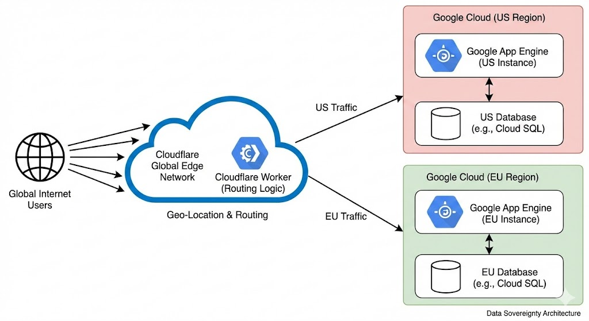

# A proxy worker for multi region services

## Introduction

This is a proxy worker for multi region services. It is a simple application that can be used to proxy requests to different regions.

## Architecture



## Prerequisites

- Node.js (v16 or higher)
- Docker
- Cloud provider (AWS, GCP, Azure, etc.)

## Features

- [ ] Proxy requests to different regions
- [ ] Handle token invalidation
- [ ] Handle rate limiting

## Installation

Prepare on local machine

```bash
$ cd backend
$ npm install
$ docker compose up -d
```

## Deploy to cloud

Coming soon 

## Running the app

```bash
$ npm run start:dev
```

## License

MIT
